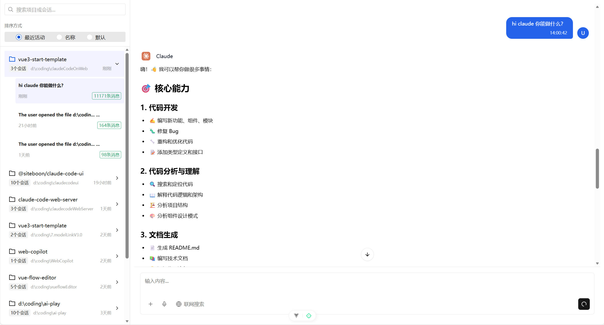
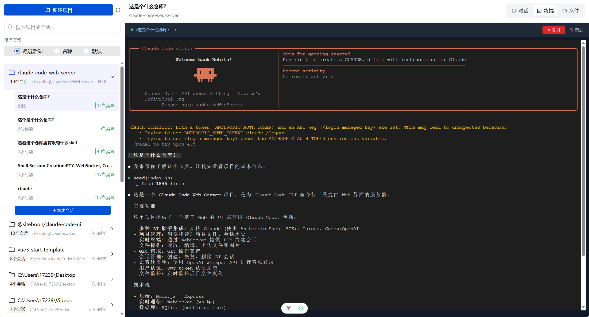

<h1 align="center">
  <a href="https://github.com/NobitaYuan/claudecode-on-web" target="_blank">Claude Code on Web</a>
</h1>

<div align="center">

顾名思义，让你的Calude code 运行在Web！
访问便捷、交互友好、异地掌控

[](https://vuejs.org/)
[](https://www.typescriptlang.org/)
[](https://vitejs.dev/)
[](LICENSE)


<hr/>


</div>

## ✨ 特性

- 🤖 **AI 驱动的编程助手** - 基于 Claude API 的智能代码助手
- 💬 **实时对话** - WebSocket 支持的流式响应
- 🖥️ **Web 终端** - 集成 xterm.js 的 Shell 终端
- 🛠️ **工具调用支持** - 完整的工具使用和结果展示
- 🎨 **现代化 UI** - 基于 TDesign 和 Tailwind CSS
- 🌗 **暗色模式** - 支持深色/浅色主题切换
- 🎯 **类型安全** - 完整的 TypeScript 类型定义

---

## 🏗️ 技术栈

### 核心框架

- **Vue 3.5** - 渐进式 JavaScript 框架（Composition API + JSX）
- **TypeScript 5.8** - JavaScript 的超集
- **Vite (Rolldown)** - 下一代构建工具

### UI 框架

- **TDesign Vue Next** - 腾讯企业级设计体系
- **Tailwind CSS** - 原子化 CSS 框架
- **Reka UI** - 无样式的 Vue 3 组件库
- **Lucide Vue Next** - 现代化图标库
- **Motion** - Vue 3 动画库
- **Animate.css** - CSS 动画库

### 状态管理 & 路由

- **Pinia** - Vue 3 状态管理
- **Vue Router 4** - 官方路由管理器
- **Pinia Plugin Persistedstate** - 状态持久化

### AI & Markdown

- **@ai-sdk/vue** - Vercel AI SDK Vue 集成
- **ai** - Vercel AI Kit
- **vue-stream-markdown** - 流式 Markdown 渲染
- **Shiki** - 语法高亮
- **Tokenlens** - Token 使用可视化

### 终端 & 可视化

- **@xterm/xterm** - 终端模拟器
  - @xterm/addon-clipboard - 剪贴板支持
  - @xterm/addon-fit - 自适应大小
  - @xterm/addon-web-links - 链接支持
  - @xterm/addon-webgl - WebGL 渲染加速

### 工具库

- **Axios** - HTTP 请求
- **VueUse** - Vue Composition API 工具集
- **version-polling** - 版本轮询

### 开发工具

- **ESLint** - 代码检查
- **Prettier** - 代码格式化
- **Husky** - Git hooks
- **Commitizen** - 规范化提交（使用 cz-git）
- **lint-staged** - 暂存文件检查
- **unplugin-auto-import** - API 自动导入
- **unplugin-vue-components** - 组件自动导入
- **vite-plugin-vue-devtools** - Vue 开发者工具

---

## 📁 项目结构

```
src/
├── api/                      # API 接口层
│   ├── user/                 # 用户相关 API
│   │   ├── index.ts          # API 方法
│   │   └── type.ts           # 类型定义
│   └── ...
├── assets/                   # 静态资源
│   ├── images/               # 图片资源
│   ├── icons/                # 图标资源
│   └── style/                # 全局样式
│       ├── main.css          # 主样式
│       ├── reset.css         # 重置样式
│       └── var.css           # CSS 变量
├── components/               # 组件库
│   ├── ai-elements/          # AI 功能组件
│   │   ├── canvas/           # 流程图画布
│   │   ├── connection/       # 连线组件
│   │   ├── controls/         # 控制组件
│   │   ├── image/            # 图片组件
│   │   ├── panel/            # 面板组件
│   │   ├── shimmer/          # 闪光效果
│   │   ├── toolbar/          # 工具栏
│   │   ├── confirmation/     # 确认操作
│   │   ├── context/          # 上下文内容
│   │   ├── inline-citation/  # 内联引用
│   │   ├── message/          # 消息组件
│   │   ├── model-selector/   # 模型选择器
│   │   ├── node/             # 节点组件
│   │   ├── open-in-chat/     # 在其他平台打开
│   │   ├── plan/             # 计划组件
│   │   ├── prompt-input/     # 输入组件
│   │   ├── reasoning/        # 推理组件
│   │   ├── task/             # 任务组件
│   │   └── tool/             # 工具组件
│   ├── demoBox.vue           # 演示盒子
│   ├── ui/                   # 基础 UI 组件
│   │   ├── carousel/         # 轮播组件
│   │   ├── hover-card/       # 悬停卡片
│   │   ├── input-group/      # 输入组
│   │   └── collapsible/      # 折叠组件
│   └── viewport_animation.vue # 视口动画
├── i18n/                     # 国际化
│   ├── index.ts              # i18n 配置
│   └── locales/              # 语言文件
│       ├── en.json           # 英文
│       └── zh-cn.json        # 简体中文
├── layout/                   # 布局组件
│   ├── index.vue             # 主布局
│   ├── header.vue            # 头部
│   ├── nav.vue               # 导航
│   └── components/           # 布局子组件
│       └── userInfo.vue      # 用户信息
├── router/                   # 路由配置
│   ├── index.ts              # 路由定义
│   └── permission.ts         # 路由权限
├── stores/                   # Pinia 状态管理
│   ├── index.ts              # Store 入口
│   ├── useDarkMode/          # 暗色模式
│   └── useUserStore/         # 用户状态
│       ├── index.ts
│       └── type.ts
├── types/                    # TypeScript 类型
│   ├── auto-imports.d.ts     # 自动导入类型
│   ├── components.d.ts       # 组件类型
│   └── vite-env.d.ts         # Vite 环境类型
├── utils/                    # 工具函数
│   ├── request/              # 请求封装
│   │   ├── index.ts
│   │   └── type.ts
│   ├── localStorage/         # 本地存储
│   │   ├── index.ts
│   │   └── token.ts
│   ├── autoUpdate.ts         # 自动更新
│   ├── index.ts              # 通用工具
│   ├── isDev.ts              # 环境判断
│   └── transParams.ts        # 参数转换
├── views/                    # 页面视图
│   ├── index/                # 主页
│   │   ├── index.vue         # 主页面
│   │   ├── chats/            # 聊天相关
│   │   │   └── index.vue
│   │   └── shell/            # Shell 终端
│   │       └── index.vue
│   ├── login/                # 登录页
│   │   └── index.vue
│   └── error/                # 错误页
│       └── 404View.vue
├── App.vue                   # 根组件
└── main.ts                   # 入口文件
```

---

## 🚀 快速开始

### 环境要求

- Node.js >= 18
- pnpm（推荐）或 npm

### 安装依赖

```bash
# 使用 pnpm（推荐）
pnpm install

# 或使用 npm
npm install
```

### 配置环境变量

根据需要编辑对应环境的配置文件：

```bash
# 开发环境
.env.development

# 测试环境
.env.test

# 生产环境
.env.production
```

环境变量说明：

```env
# 页面标题
VITE_APP_TITLE = 'claudecode-on-web'

# 当前环境
VITE_APP_ENV = 'development'

# 服务端接口地址
VITE_APP_BASE_API_URL = '/api'
```

### 启动开发服务器

```bash
# 开发模式
pnpm dev

# 或者
npm run dev
```

开发服务器默认运行在 `http://localhost:5173`

### 构建生产版本

```bash
# 开发环境构建
pnpm build-dev

# 测试环境构建
pnpm build-test

# 生产环境构建
pnpm build-pro

# 通用构建
pnpm build
```

### 代码检查

```bash
# ESLint 检查
pnpm lint

# ESLint 自动修复
pnpm lint:fix
```

### 预览构建结果

```bash
pnpm preview
```

---

## 📦 核心功能

### 1. AI 对话系统

- 实时流式响应
- 上下文管理
- 多轮对话支持
- 消息类型转换和过滤
- 模型选择器

### 2. 计划模式

- 节点流程图展示
- 交互式节点操作
- 连线可视化
- 节点工具栏
- 图布局算法

### 3. Web 终端

- xterm.js 终端模拟
- WebSocket 连接
- 剪贴板支持
- 自适应大小
- WebGL 渲染加速
- 主题定制

### 4. 任务管理

- 后台任务执行
- 任务状态监控
- 任务结果展示
- 进度追踪

### 5. 工具调用

- 工具使用展示
- 工具结果渲染
- 错误处理和重试
- 输入/输出使用量统计

### 6. 用户体验

- 自动更新检测
- 暗色模式切换
- 响应式设计
- 加载动画
- 进度条提示

---

## 🔧 开发指南

### 代码规范

项目使用 ESLint 和 Prettier 进行代码质量控制：

```bash
# 代码检查
pnpm lint

# 自动修复
pnpm lint:fix
```

### Git 提交规范

使用 Commitizen + cz-git 进行规范化提交：

```bash
# 添加暂存
git add .

# 使用 Commitizen 提交（推荐）
pnpm cz
```

提交类型（cz-git）：

- `feat`: 新功能 ✨
- `fix`: 修复 Bug 🐛
- `docs`: 文档更新 📝
- `style`: 代码格式调整 💄
- `refactor`: 代码重构 ♻️
- `perf`: 性能优化 ⚡
- `test`: 测试相关 ✅
- `chore`: 构建/工具变动 🔧
- `ci`: CI 配置 👷
- `revert`: 回滚提交 ⏪

### 组件自动导入

项目配置了组件自动导入（unplugin-vue-components）：

```vue
<script setup lang="ts">
// TDesign 组件会自动导入，无需手动引入
</script>

<template>
  <!-- 直接使用，无需 import -->
  <t-button>Click me</t-button>
  <t-input placeholder="输入内容" />
</template>
```

### API 自动导入

Vue 和 Vue Router 的 API 会自动导入（unplugin-auto-import）：

```vue
<script setup lang="ts">
// 无需手动 import ref、computed、watch 等
const count = ref(0)
const doubled = computed(() => count.value * 2)
</script>
```

## 🔐 环境变量说明

| 变量名                  | 说明         | 默认值                |
| ----------------------- | ------------ | --------------------- |
| `VITE_APP_TITLE`        | 页面标题     | `'claudecode-on-web'` |
| `VITE_APP_ENV`          | 当前环境     | `'development'`       |
| `VITE_APP_BASE_API_URL` | API 基础路径 | `'/api'`              |

---

## 📝 License

[MIT](LICENSE)

Copyright (c) 2024-present

---

## 🤝 贡献

欢迎提交 Issue 和 Pull Request！

1. Fork 本仓库
2. 创建特性分支 (`git checkout -b feature/AmazingFeature`)
3. 提交更改 (`git commit -m 'feat: add some amazing feature'`)
4. 推送到分支 (`git push origin feature/AmazingFeature`)
5. 提交 Pull Request

---

## 📧 联系方式

如有问题或建议，请通过以下方式联系：

- 提交 [Issue](../../issues)
- 发起 [Discussion](../../discussions)

---

<div align="center">

**Made with ❤️ by Vue 3 + TypeScript + Claude**

</div>
